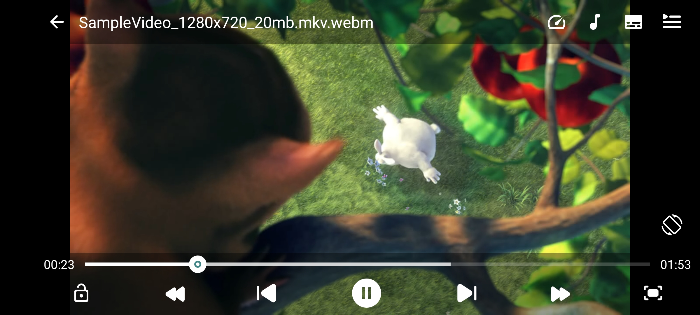

# Mk Player

Mk Player is an Android video player written in Java (min sdk 28). It provides a simple and easy-to-use interface for users to play videos.

**This project is still in development and is expected to have bugs. Please report any bugs you find in
the [Issues](https://github.com/MkSikander/MkPlayer/issues) section.**

## Screenshots

### Video Folders And Video List Screens

### Player Ui

## Supported formats

- **Video**: H.263, H.264 AVC , H.265 HEVC, MPEG-4 SP, VP8, VP9, AV1
    - Support depends on Android device
- **Audio**: Vorbis, Opus, FLAC, ALAC, PCM/WAVE (μ-law, A-law), MP1, MP2, MP3, AMR (NB, WB), AAC (LC, ELD, HE; xHE on Android 9+), AC-3, E-AC-3, DTS,
  DTS-HD, TrueHD
    - Support provided by ExoPlayer FFmpeg extension
- **Subtitles**: SRT, SSA, ASS, TTML, VTT, DVB
    - SSA/ASS has limited styling support see [this issue](https://github.com/google/ExoPlayer/issues/8435)

## Features

- Android app with simple and easy-to-use interface
- Software decoders for h264 and hevc
- Audio/Subtitle track selection
- Vertical swipe to change brightness (left) / volume (right)
- Horizontal swipe to seek through video
- [Material 3 (You)](https://m3.material.io/) support
- Media picker with folder and file view
- Control playback speed
- Zoom gesture

## Contributing

Contributions are welcome!

## Credits

### Open Source Projects

- [NextPlayer](https://github.com/anilbeesetti/nextplayer)
- ...

## License

Mk Player is licensed under the GNU General Public License v3.0. See the [LICENSE](LICENSE) file for more information.

